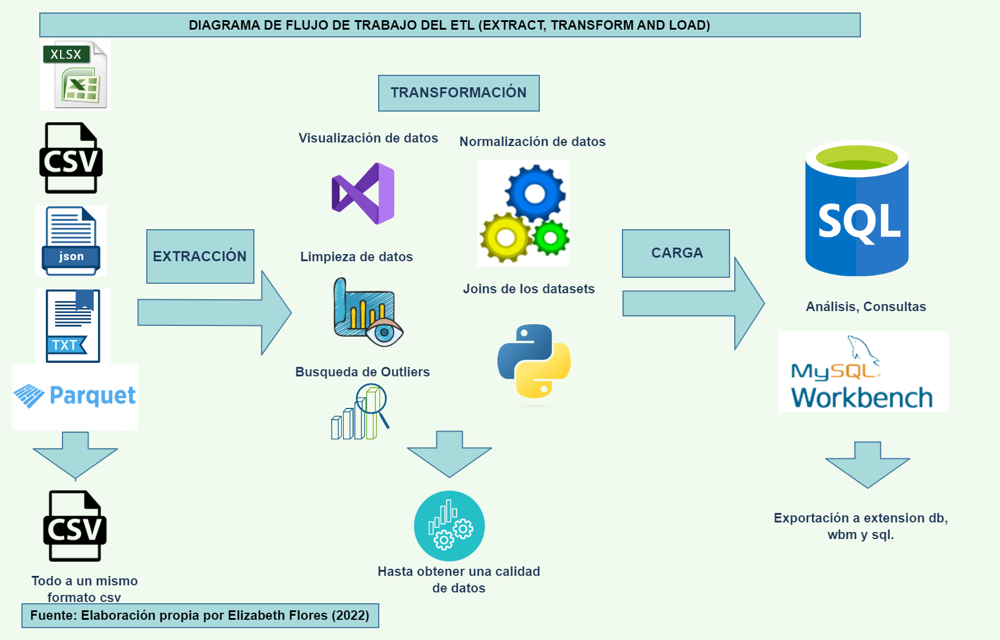
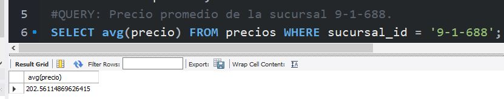

# Project: Survey of prices in different markets.
## Proyecto: Relevamiento de precios en distintos mercados.
In this project, an ETL (Extract, transform and Load) process was carried out from a data set, which focused on the same business perspective. The data varies from various sources of price surveys in different markets in Argentina, then the DER was carried out through MySQL Worbench.

The process of the project video in this link

## ETL Workflow Diagram.

Then, according to the three stages of the ETL process and the required subtopics, the following is presented:

## STAGE 1: EXTRACTION
Firstly, the datasets were acquired from the Github site, in xlsx, csv, json, txt and parquet formats, which were taken to the same extension that is csv, since it is more advisable to work with this extension for this type of data. (datasets). For this stage, the Visual Studio development environment was used and Python was used as the programming language.

## STAGE 2: TRANSFORMATION
This stage used the Python tool and is divided into the following substages:
### 1) Data visualization
Here a visualization of the data was made, Python modules such as .head(), sample(), df.isnull().sum() were used to see how the data is formed and then continue with the other audit.
### 3) Data cleaning
For null data I decided to remove some columns whenever the majority (>70%) is null, as well as instead of removing rows I decided to use the .fillna(method="bfill") module that fills in the null data, based on to the value of the next row.
### 4) Outlier Search
I used sample() to see which values ​​are atypical, that is, different from the majority or that do not happen in real life, I also observed if there were duplicate values ​​in the id of the datasets.
### 5) Data normalization
Both in the columns, that is, the headers, some headers such as the id were normalized to product_id, in the case of the rows (records) there were several outliers in several columns and they proceeded to label them correctly, transforming the numeric fields by putting the same amount of digits for all, or by replacing the "." by the "," for the price column for example.
### 6) Joins of the datasets
The concat function in Python was used to concatenate the price_weeks tables, since they had the same nomenclature in the columns and the records were similar, we proceeded to join the 5 dimension tables in a single general table to be more optimal in the rest. audits.

## STAGE 3: CHARGING
Finally, the SQLAlchemy library in Python was used to be able to connect to the database that previously created it in MySQL "preciosdb", from there I loaded the datasets all ok to my database, then the alter tables were made, for assign PRIMARY KEY and FOREIGN KEY that warranted it.
The generated database is finally shown like this:

### query
Finally, a query was made to verify if the database works: Average price of the 9-1-688 branch, which resulted in:203.64690382081687.
